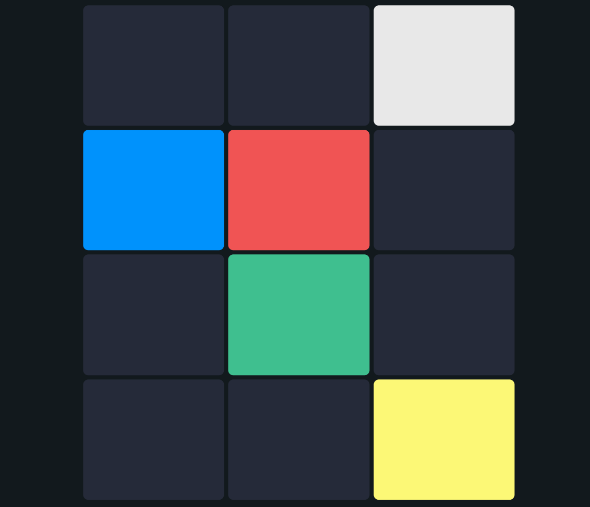

# drumpad
Are you looking for a music studio to create beats? Then you find the right one! With the trap drum pad you'll be able to make music with the ready to use trap drum kits.
## Usage
Using numpad for playing: `Numlock`, `/`, `*`, `7`, `8`, `9`, `4`, `5`, `6`, `1`, `2`, `3`  
or can touch it!

## Preview

  

## Library
App have using sound of [Trap Drum Pads 24](https://play.google.com/store/apps/details?id=com.paullipnyagov.trapdrumpads24&hl=vi&gl=US)
